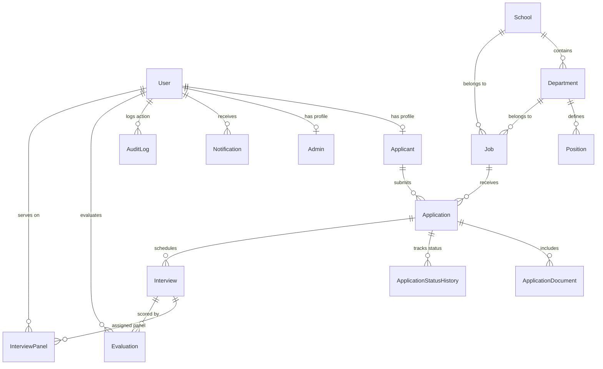

# DYPIU Recruitment Portal — Comprehensive Project Documentation

## 1. Executive Summary

The **DYPIU Recruitment Portal** is an end-to-end recruitment management web platform engineered specifically for **D Y Patil International University (DYPIU)**. It digitizes and streamlines the hiring life-cycle for both **Teaching (Academic)** and **Non-Teaching (Administrative / Staff)** positions.

The platform provides a modern candidate experience (from discovering vacancies to completing a comprehensive application form and tracking progress) alongside a role-based recruitment dashboard for HR Admins, Super Admins, and Committee Members (covering job posting management, dossier review, status workflows, interview scheduling, scorecard evaluation, audit logging, and reporting).

---

## 2. Technical Stack & Architecture

### Frontend Layer
- **Framework**: React 18 with Vite
- **Routing**: React Router DOM (v7) with path-based protection (`ApplicantRoute`, `AdminRoute`)
- **Styling**: Vanilla CSS custom Design System (`index.css`), modern glassmorphism, responsive grid & flexbox layouts, CSS variables, Google Fonts (`Inter`, `Outfit`)
- **UI Components & Utilities**: Custom dynamic carousels (`VacancySlider`), interactive modal dialogs (`InterestModal`), canonical status helpers (`status.js`)
- **State & Auth**: Context API (`AuthContext`), persistent session storage, Bearer JWT authorization
- **Mock API Layer**: Dual-mode API adapter (`api.js` + `mockApi.js`) allowing zero-backend offline demonstration when `VITE_MOCK_API=true`

### Backend Layer
- **Runtime & Server**: Node.js v18+ / v20+ with Express.js REST API
- **ORM & Database Client**: Prisma ORM (v5.22.0)
- **Database Engine**: PostgreSQL (Production & Local Development)
- **Security & Protection**:
  - **Authentication**: JWT token-based authentication (Access & Refresh tokens) with bcryptjs password hashing (salt rounds: 10)
  - **Authorization**: Mandatory applicant login for application submission; role-based access control (`SUPER_ADMIN`, `HR_ADMIN`, `HR_USER`, `ADMIN`, `COMMITTEE_MEMBER`, `APPLICANT`)
  - **Security Headers**: Express `helmet` middleware for HTTP security
  - **Rate Limiting**: `express-rate-limit` for global API protection (300 requests / 15 mins) and strict auth protection (30 login attempts / 15 mins)
  - **File Validation**: `multer` middleware with strict MIME type checking (PDF only) and 5MB size limit
  - **CORS**: Express CORS middleware configured via `CORS_ORIGIN` environment variable

### Storage & Deployment
- **File Storage**: Local filesystem storage with dynamic folder creation (`uploads/`, `/storage/applications`)
- **Document Access**: Authenticated document downloads via `/api/applications/documents/:id/download` with ownership authorization
- **Process Manager**: PM2 for background process execution in production environments
- **Web Server & Reverse Proxy**: Nginx reverse proxy setup with file protection rules blocking direct web access to `/storage/`

---

## 3. Database Architecture & Data Models

The system database is modeled in `prisma/schema.prisma` with relational integrity, cascading deletes, and strategic indexes:



### Canonical Application Status Architecture

The platform enforces a single source of truth for application statuses across backend controllers, Prisma queries, API JSON payloads, and frontend UI badges:

| Machine Enum (`backend/src/constants/statuses.js`) | Human Display Label (`frontend/src/utils/status.js`) | CSS Badge Class |
|---|---|---|
| `DRAFT` | Draft | `status-submitted` |
| `SUBMITTED` | Application Submitted | `status-submitted` |
| `UNDER_REVIEW` | Under Review | `status-under-review` |
| `SHORTLISTED` | Shortlisted | `status-shortlisted` |
| `INTERVIEW_SCHEDULED` | Interview Scheduled | `status-interview` |
| `SELECTED` | Selected | `status-selected` |
| `WAITLISTED` | Waitlisted | `status-waitlisted` |
| `REJECTED` | Not Selected | `status-not-selected` |
| `WITHDRAWN` | Withdrawn | `status-not-selected` |
| `CLOSED` | Application Closed | `status-closed` |

---

## 4. API Endpoints & Response Contracts

### List Endpoints Contract
All admin list endpoints (`/api/applications`, `/api/admin/vacancies`, `/api/admin/audit-logs`) return a standardized paginated wrapper:
```json
{
  "data": [ ... ],
  "pagination": {
    "total": 45,
    "page": 1,
    "limit": 10,
    "totalPages": 5
  }
}
```
*Note: The candidate endpoint `/api/applications/my` returns a direct array of candidate applications for simpler client integration.*

### Key API Routes Overview

- **Auth**:
  - `POST /api/auth/register` — Candidate registration
  - `POST /api/auth/login` — User authentication (returns token & full profile)
  - `GET /api/auth/me` — Retrieve current authenticated user session
- **Public Vacancies & Structure**:
  - `GET /api/public/vacancies` — List active published vacancies
  - `GET /api/public/vacancies/:id` — Vacancy details
  - `POST /api/public/vacancy-interest` — Register interest for closed/future roles
- **Applications**:
  - `GET /api/applications` — Admin search & list applications (`{ data, pagination }`)
  - `GET /api/applications/my` — Applicant personal dashboard list
  - `POST /api/applications` — Create application draft for specific `jobId`
  - `POST /api/applications/:id/submit` — Final application submission
  - `POST /api/applications/:id/upload` — Upload PDF application documents
  - `GET /api/applications/documents/:id/download` — Download attached document file
  - `PATCH /api/applications/:id/status` — HR status update & workflow logging
- **Interviews & Evaluation**:
  - `GET /api/interviews` — List scheduled interviews
  - `POST /api/interviews` — Schedule candidate interview
  - `POST /api/interviews/:id/evaluation` — Submit committee evaluation scorecard
- **Reports & Audit**:
  - `GET /api/reports` — Numerical recruitment pipeline report by vacancy
  - `GET /api/admin/audit-logs` — Audit trail log entries
