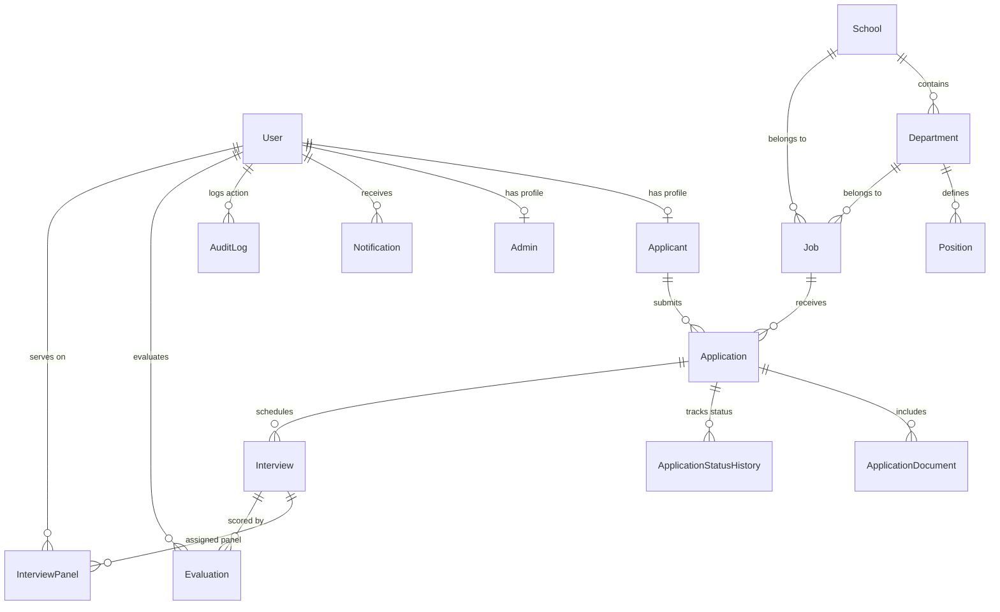

# DYPIU Recruitment Portal — Comprehensive Project Documentation

## 1. Executive Summary

The **DYPIU Recruitment Portal** is an end-to-end recruitment management web platform engineered specifically for **D Y Patil International University (DYPIU)**. It digitizes and streamlines the hiring life-cycle for both **Teaching (Academic)** and **Non-Teaching (Administrative / Staff)** positions.

The platform provides a modern candidate experience (from discovering vacancies to completing a comprehensive 7-section application and tracking progress) alongside a role-based recruitment dashboard for HR Admins, Super Admins, and Committee Members (covering job posting management, dossier review, status workflows, interview scheduling, scorecard evaluation, audit logging, and reporting).

---

## 2. Technical Stack & Architecture

### Frontend Layer
- **Framework**: React 18 with Vite
- **Routing**: React Router DOM (v6) with path-based protection (`ApplicantRoute`, `AdminRoute`)
- **Styling**: Vanilla CSS custom Design System (`index.css`), modern glassmorphism, responsive grid & flexbox layouts, CSS variables, Google Fonts (`Inter`, `Outfit`)
- **Icons & UI Utilities**: Lucide Icons (`lucide-react`), custom dynamic sliders (`VacancySlider`), interactive modal dialogs (`InterestModal`)
- **State & Auth**: Context API (`AuthContext`), persistent session storage, Bearer JWT authorization

### Backend Layer
- **Runtime & Server**: Node.js v18+ with Express.js REST API
- **ORM & Database Client**: Prisma ORM (v5.22.0)
- **Database Engine**: PostgreSQL (Production) / SQLite (`dev.db` for zero-config local development)
- **Security & Protection**:
  - **Authentication**: JWT token-based authentication with bcryptjs password hashing (salt rounds: 10)
  - **Security Headers**: Express `helmet` middleware for HTTP security
  - **Rate Limiting**: `express-rate-limit` for global API protection (300 requests / 15 mins) and strict auth protection (30 login attempts / 15 mins)
  - **File Validation**: `multer` middleware with strict MIME type checking (PDF only) and 5MB size limit
  - **CORS**: Express CORS middleware configured for cross-origin API calls

### Storage & Utilities
- **File Storage**: Local filesystem storage with dynamic folder creation (`uploads/`, `/storage/applications`)
- **Exports & Analytics**: Excel export support via `xlsx` library
- **Process Manager**: PM2 for background process execution in production environments
- **Web Server & Reverse Proxy**: Nginx reverse proxy setup with file protection rules blocking direct access to `/storage/`

---

## 3. Database Architecture & Data Models

The system database is modeled in `prisma/schema.prisma` with relational integrity, cascading deletes, and strategic indexes:



### Core Models Detail

1. **`User`**:
   - Stores authentication credentials (`email`, `password`), status (`ACTIVE`, `INACTIVE`, `SUSPENDED`), and role (`SUPER_ADMIN`, `HR_ADMIN`, `HR_USER`, `COMMITTEE_MEMBER`, `APPLICANT`, `ADMIN`).
2. **`Applicant`**:
   - Linked 1:1 to `User`, stores candidate primary profile (`name`, `mobile`).
3. **`Admin`**:
   - Administrative profile linked 1:1 to `User`.
4. **`School`, `Department`, `Position`**:
   - Organizational taxonomy for categorization (Teaching vs Non-Teaching).
5. **`Job` (Vacancy)**:
   - Stores job postings with unique vacancy numbers (`VAC-YYYY-XXX`), position details, qualifications, experience requirements, salary scales, opening/deadline dates, and status (`DRAFT`, `PUBLISHED`, `CLOSED`, `ARCHIVED`).
6. **`VacancyInterest`**:
   - Stores candidate submissions from the "Register Interest" modal for general talent banking when specific roles aren't currently open.
7. **`Application`**:
   - Represents candidate job applications with unique IDs (`APP-YYYY-XXXXXX`).
   - Lifecycle Statuses: `DRAFT`, `SUBMITTED`, `UNDER_REVIEW`, `SHORTLISTED`, `REJECTED`, `INTERVIEW_SCHEDULED`, `OFFERED`, `HIRED`, `WITHDRAWN`.
   - Stores structured application data in 7 serialized JSON sections:
     - `personalInfo`: Full name, DOB, gender, marital status, nationality, category, father/spouse name.
     - `contactDetails`: Email, phone, alternate phone, present address, permanent address.
     - `qualifications`: Class 10th, 12th, Graduation, Post-Graduation, Doctorate/Ph.D. with institute, board/university, pass year, percentage/CGPA.
     - `experience`: Employment history list with employer name, designation, pay scale, from date, to date, nature of duties.
     - `researchDetails`: (Teaching) Ph.D. status, thesis title, guide, journal publications, books, patents, research projects.
     - `skillsCertificates`: Key skills, professional certifications, awards & extra achievements.
     - `references`: Professional reference details (2 references with name, designation, organization, contact, email).
8. **`ApplicationDocument`**:
   - Attached files (`documentType`: resume, qualification, experience, research, other) with original name, size, mime type, and disk storage key.
9. **`ApplicationStatusHistory`**:
   - Status change audit log tracking previous status, new status, changed by user, comments, and timestamp.
10. **`Interview` & `InterviewPanel`**:
    - Scheduling system detailing round name, candidate, job, date, time, mode (`IN_PERSON` / `ONLINE`), venue, meeting link, and assigned panel members.
11. **`Evaluation`**:
    - Scoring rubric for committee members to rate candidate communication (0-10), technical knowledge (0-10), experience (0-10), and domain fit (0-10), compute total score, and select recommendation (`RECOMMEND`, `HOLD`, `REJECT`).
12. **`AuditLog`**:
    - Tracks administrative actions (create, update, delete, status change) with action name, entity type, entity ID, old/new payload snapshots, user ID, and IP address.

---

## 4. Key Modules & Features Implemented

### A. Public Career Portal
- **Homepage (`Home.jsx`)**:
  - Hero banner slider showcasing DYPIU campus & academic opportunities (`VacancySlider.jsx`).
  - Quick action buttons (Apply Now, Teaching Positions, Non-Teaching Positions, Track Application).
  - Highlights open positions with instant filters.
  - Interactive "Register Interest" modal (`InterestModal.jsx`) for talent pool capture.
- **Vacancy Browsing (`TeachingPositions.jsx`, `NonTeachingPositions.jsx`)**:
  - Filter positions by department, category, and keyword search.
  - Vacancy cards displaying vacancy number, deadline countdown, department, and salary scale.
- **Detailed Vacancy Page (`JobDetails.jsx`)**:
  - In-depth requirements breakdown: qualification, experience, skills, eligibility criteria, and required documents.
- **Application Tracking (`TrackApplication.jsx`)**:
  - Public lookup mechanism using Application Number (`APP-2026-XXXXXX`) and Email without requiring candidate login.

### B. Applicant Workspace
- **Authentication (`Login.jsx`, `Register.jsx`)**:
  - Candidate registration with validation, password complexity guidelines, and immediate token issuance.
- **Applicant Dashboard (`ApplicantDashboard.jsx`)**:
  - Overview of all active and past applications.
  - Real-time status progress badge indicator.
  - Upcoming interview schedule details with venue / meeting links.
- **Multi-Stage Application Form (`ApplicationForm.jsx`)**:
  - 7-section structured form with draft autosaving.
  - Dynamic table rows for multi-degree education and multi-job experience records.
  - PDF file uploader supporting multi-document attachments (Resume, Qualification Certificates, Experience Certificates, Research Papers).
- **Application Summary & Details (`ApplicantApplicationDetails.jsx`, `ApplicationSuccess.jsx`)**:
  - Full view of submitted dossier, printable summary, uploaded document previews, and status update timeline.

### C. Recruiter & HR Admin Portal
- **Admin Dashboard (`AdminDashboard.jsx`)**:
  - KPI metric cards: Total Vacancies, Received Applications, Shortlisted Candidates, Scheduled Interviews.
  - Quick application processing table and recent activity stream.
- **Vacancy Management (`AdminJobs.jsx`, `AdminCreateJob.jsx`, `AdminJobDetails.jsx`)**:
  - Vacancy creation wizard with auto-generated vacancy numbers (`VAC-YYYY-XXX`).
  - Manage vacancy status (`DRAFT`, `PUBLISHED`, `CLOSED`, `ARCHIVED`).
- **Application Screening Dossier (`AdminApplications.jsx`, `AdminReviewApplication.jsx`)**:
  - Comprehensive applicant grid with multi-filter parameters (Job, Department, Status, Date).
  - Full Dossier Review modal/page presenting candidate JSON details and integrated PDF viewer for uploaded documents.
  - Status progression tool with mandatory change notes & candidate email notification trigger.
- **Talent Pool Interest Portal (`AdminInterestedApplicants.jsx`)**:
  - Manage candidates who submitted general interest, with filtering and status updates (`PENDING`, `NOTIFIED`).
- **Interview & Panel Scheduler (`AdminInterviews.jsx`)**:
  - Schedule interview rounds, set dates/times, assign committee users to panel, select venue/meeting link.
- **Committee Member Scorecard (`CommitteeDashboard.jsx`)**:
  - Panel evaluator portal to view assigned interview candidates and submit scorecards across 4 evaluation parameters plus final recommendation.
- **User & Role Access Management (`AdminUsers.jsx`)**:
  - Manage staff/admin accounts, assign roles (`SUPER_ADMIN`, `HR_ADMIN`, `HR_USER`, `COMMITTEE_MEMBER`), and toggle account statuses (`ACTIVE` / `SUSPENDED`).
- **Audit Trail & System Security (`AdminAuditLogs.jsx`)**:
  - Searchable audit log of every status change, job update, user modification, and system action.
- **Analytics & Exports (`AdminReports.jsx`)**:
  - Dynamic report generation and XLSX Excel spreadsheet exports.

---

## 5. Project Directory Structure

```
recruitment portal/
├── backend/
│   ├── src/
│   │   ├── controllers/
│   │   │   ├── applicationController.js      # Application creation, screening, status & uploads
│   │   │   ├── auditController.js            # Audit log retrieval & logging
│   │   │   ├── authController.js             # User login, registration, JWT & session
│   │   │   ├── committeeController.js        # Panel assignments & evaluations
│   │   │   ├── evaluationController.js       # Interview scoring rubric
│   │   │   ├── interviewController.js        # Interview scheduling & management
│   │   │   ├── jobController.js              # Job vacancies & organization taxonomy
│   │   │   ├── notificationController.js     # Notifications dispatch
│   │   │   ├── reportController.js           # Analytics & Excel export logic
│   │   │   ├── userController.js             # User accounts & RBAC management
│   │   │   └── vacancyInterestController.js  # Talent pool interest forms
│   │   ├── middleware/
│   │   │   ├── authMiddleware.js             # JWT verification & role authorization
│   │   │   └── uploadMiddleware.js           # Multer disk upload & PDF filter
│   │   ├── routes/
│   │   │   ├── adminRoutes.js
│   │   │   ├── applicationRoutes.js
│   │   │   ├── authRoutes.js
│   │   │   ├── committeeRoutes.js
│   │   │   ├── interviewRoutes.js
│   │   │   ├── jobRoutes.js
│   │   │   ├── notificationRoutes.js
│   │   │   ├── reportRoutes.js
│   │   │   └── vacancyInterestRoutes.js
│   │   ├── services/
│   │   │   └── prisma.js                     # Shared Prisma Client instance
│   │   ├── index.js                          # Express app entrypoint & middlewares
│   │   └── seed.js                           # Seeder script for admin user & initial jobs
│   ├── package.json
│   └── .env
├── frontend/
│   ├── src/
│   │   ├── components/
│   │   │   ├── AdminHeader.jsx               # Header for Admin layout
│   │   │   ├── AdminLayout.jsx               # Sidebar + Header wrapper layout
│   │   │   ├── AdminSidebar.jsx              # Navigation sidebar for HR/Admin
│   │   │   ├── Footer.jsx                    # Footer component for public portal
│   │   │   ├── Header.jsx                    # Top navbar with login state
│   │   │   ├── InterestModal.jsx             # Register Interest candidate popup
│   │   │   └── VacancySlider.jsx             # Homepage hero banner slider
│   │   ├── context/
│   │   │   └── AuthContext.jsx               # React context for Auth & user state
│   │   ├── pages/
│   │   │   ├── AdminApplications.jsx
│   │   │   ├── AdminAuditLogs.jsx
│   │   │   ├── AdminCreateJob.jsx
│   │   │   ├── AdminDashboard.jsx
│   │   │   ├── AdminInterestedApplicants.jsx
│   │   │   ├── AdminInterviews.jsx
│   │   │   ├── AdminJobDetails.jsx
│   │   │   ├── AdminJobs.jsx
│   │   │   ├── AdminLogin.jsx
│   │   │   ├── AdminReports.jsx
│   │   │   ├── AdminReviewApplication.jsx
│   │   │   ├── AdminUsers.jsx
│   │   │   ├── ApplicantApplicationDetails.jsx
│   │   │   ├── ApplicantDashboard.jsx
│   │   │   ├── ApplicationForm.jsx
│   │   │   ├── ApplicationSuccess.jsx
│   │   │   ├── CommitteeDashboard.jsx
│   │   │   ├── Home.jsx
│   │   │   ├── JobDetails.jsx
│   │   │   ├── Login.jsx
│   │   │   ├── NonTeachingPositions.jsx
│   │   │   ├── Register.jsx
│   │   │   ├── TeachingPositions.jsx
│   │   │   └── TrackApplication.jsx
│   │   ├── App.css
│   │   ├── index.css                         # Primary Design System stylesheet
│   │   ├── App.jsx                           # Application Router & Layout routes
│   │   └── main.jsx                          # React application entrypoint
│   ├── package.json
│   └── vite.config.js
├── prisma/
│   └── schema.prisma                         # Prisma database schema definition
├── deploy-ubuntu.sh                          # Automated production deployment bash script
├── package.json                              # Root scripts & dependencies
└── README.md
```

---

## 6. Primary API Endpoints Reference

### Authentication (`/api/auth`)
| Method | Endpoint | Access | Description |
| :--- | :--- | :--- | :--- |
| `POST` | `/api/auth/register` | Public | Register new candidate account |
| `POST` | `/api/auth/login` | Public | Login user & return JWT token |
| `POST` | `/api/auth/refresh` | Public | Refresh JWT session token |
| `GET` | `/api/auth/me` | Authenticated | Fetch logged-in user profile details |

### Vacancies & Structure (`/api/jobs`)
| Method | Endpoint | Access | Description |
| :--- | :--- | :--- | :--- |
| `GET` | `/api/public/vacancies` | Public | Fetch published jobs with filters |
| `GET` | `/api/public/vacancies/:id` | Public | Get public vacancy details |
| `GET` | `/api/admin/vacancies` | Admin | List all vacancies including drafts |
| `POST` | `/api/admin/vacancies` | Admin | Create a new job vacancy |
| `PUT` | `/api/admin/vacancies/:id` | Admin | Update job vacancy details |
| `PATCH` | `/api/admin/vacancies/:id/status` | Admin | Change vacancy status (DRAFT/PUBLISHED/CLOSED) |

### Applications (`/api/applications`)
| Method | Endpoint | Access | Description |
| :--- | :--- | :--- | :--- |
| `POST` | `/api/applications` | Applicant | Start new draft application |
| `GET` | `/api/applications/my` | Applicant | Get current applicant's applications |
| `GET` | `/api/applications` | Admin | Get applications list with screening filters |
| `GET` | `/api/applications/:id` | Authenticated | Get full application dossier details |
| `PUT` | `/api/applications/:id` | Applicant | Save draft application section data |
| `POST` | `/api/applications/:id/submit` | Applicant | Final submit application |
| `PATCH` | `/api/applications/:id/status` | Admin | Update screening status with comments |
| `POST` | `/api/applications/:id/documents` | Applicant | Upload PDF supporting document |
| `GET` | `/api/applications/:id/documents/:docId/download` | Authenticated | Download candidate document |

### Interviews & Evaluations (`/api/interviews`)
| Method | Endpoint | Access | Description |
| :--- | :--- | :--- | :--- |
| `GET` | `/api/interviews` | Authenticated | List scheduled interviews |
| `POST` | `/api/interviews` | Admin | Schedule interview for application |
| `POST` | `/api/interviews/:id/panel` | Admin | Assign committee members to panel |
| `POST` | `/api/interviews/:id/evaluation` | Committee | Submit evaluation scorecard |
| `GET` | `/api/interviews/:id/evaluation` | Committee/Admin | View evaluations for an interview |

### User Management & System (`/api/admin`)
| Method | Endpoint | Access | Description |
| :--- | :--- | :--- | :--- |
| `GET` | `/api/admin/users` | Super Admin / HR | List registered users and roles |
| `POST` | `/api/admin/users` | Super Admin | Create admin or committee user |
| `PATCH` | `/api/admin/users/:id/status` | Super Admin | Toggle account status (`ACTIVE`/`SUSPENDED`) |
| `PATCH` | `/api/admin/users/:id/role` | Super Admin | Update user role |
| `GET` | `/api/admin/audit-logs` | Super Admin / HR | Query system activity audit logs |

---

## 7. User Roles & Access Control Matrix

| Capability / Module | APPLICANT | HR_USER | COMMITTEE_MEMBER | HR_ADMIN | SUPER_ADMIN |
| :--- | :---: | :---: | :---: | :---: | :---: |
| Browse & Search Vacancies | ✅ | ✅ | ✅ | ✅ | ✅ |
| Track Application by Number | ✅ | ✅ | ✅ | ✅ | ✅ |
| Submit & Manage Applications | ✅ | ❌ | ❌ | ❌ | ❌ |
| View Applications Dossiers | Own Only | ✅ | Assigned Only | ✅ | ✅ |
| Create / Edit Job Vacancies | ❌ | ✅ | ❌ | ✅ | ✅ |
| Update Candidate Status | ❌ | ✅ | ❌ | ✅ | ✅ |
| Schedule Interviews | ❌ | ✅ | ❌ | ✅ | ✅ |
| Submit Evaluation Scorecards | ❌ | ❌ | ✅ | ✅ | ✅ |
| User & Role Management | ❌ | ❌ | ❌ | ✅ | ✅ |
| System Audit Logs | ❌ | ❌ | ❌ | ✅ | ✅ |
| Reports & Excel Exports | ❌ | ✅ | ❌ | ✅ | ✅ |

---

## 8. Deployment & Operational Commands

### Development Setup
```bash
# 1. Install root & service dependencies
npm run install:all

# 2. Setup database schema & seed initial admin user + default jobs
npm run db:setup

# 3. Launch Backend (Port 5000) and Frontend (Port 5173) concurrently
npm run dev
```

**Default Admin Credentials (after seed):**
- **Email**: `admin@dypiu.edu`
- **Password**: `AdminPassword123`

### Production Ubuntu Deployment
An automated deployment script [`deploy-ubuntu.sh`](file:///c:/Users/nisha/recruitment%20portal/deploy-ubuntu.sh) is provided in the repository root:

```bash
sudo bash deploy-ubuntu.sh
```

**Script Actions:**
1. Installs Node.js 20 LTS, PostgreSQL, PM2, and Nginx.
2. Configures production PostgreSQL database (`dypiu_recruitment`).
3. Generates Prisma Client and runs database migrations (`prisma db push`).
4. Configures PM2 background process manager to ensure zero-downtime execution.
5. Configures Nginx reverse proxy on Port 80 with security rules blocking public access to private file uploads (`/storage/`).
